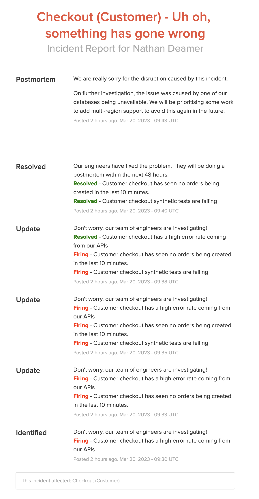

[](https://github.com/nathandeamer/prometheus-alerts-to-statuspage/actions/workflows/main.yml)

# Prometheus Alerts to Atlassian Statuspage
Do you have multiple alerts firing at once from Prometheus Alertmanager that only effect one part of your system? And you only want to report one incident on a Atlassian Statuspage?  Then give this custom solution a go!

## Example:
### Scenario: Ecommerce - Checkout
A problem with customers being able to checkout in our system was being detected  in multiple ways (and sometimes by multiple teams)
- Alert 1: Customer checkout has a high error rate coming from our APIs
- Alert 2: Customer checkout has seen no orders being created in the last 10 minutes
- Alert 3: Customer checkout synthetic tests are failing

But the root  cause for these alerts, which were all firing around the same time, is probably the same! A resource or service required to checkout has fallen over.

## Prerequisites
1. A [Atlassian Statuspage](https://www.atlassian.com/software/statuspage) account
2. Page and Components configured in Atlassian Statuspage and the page and component ids.
3. Your Atlassian Statuspage API key

## Usage:
### 1. Environment variables:
#### Required:
1. `STATUSPAGE_APIKEY` - Statuspage API Key
#### Optional:
If you want to override any of the handlebar templates (see [4. Status page: Configuring incident title and body](#4-status-page-configuring-incident-title-and-body)) 
1. `STATUSPAGE_INCIDENT_TITLE_TEMPLATE`
2. `STATUSPAGE_INCIDENT_CREATED_BODY_TEMPLATE`
3. `STATUSPAGE_INCIDENT_UPDATED_BODY_TEMPLATE`
4. `STATUSPAGE_INCIDENT_RESOLVED_BODY_TEMPLATE`  

**Defaults:** See [application.yml](src/main/resources/application.yml)

### 2. Prometheus alerts
Configure your prometheus alerts with the `statuspage` labels and annotations

```yaml
- alert: [Alert Name]
  expr: [Alert Expression]
  labels:
    statuspage: true # Used for alert route to send to the statuspage
    statuspagePageId: abc123 # The statuspage id you want to update (from statuspage)
    statuspageComponentId: def456 # The statuspage component you want to update (from statuspage)
  annotations:
    statuspageComponentName: [Component Name] # Used in the incident title on statuspage.
    statuspageStatus: identified # identified|investigating|monitoring|resolved
    statuspageImpactOverride: critial  # none|maintenance|minor|major|critical
    statuspageComponentStatus: major_outage # none|operational|under_maintenance|degraded_performance|partial_outage|major_outage
    statuspageSummary: [Summary for statuspage] # Used for display text on statuspage
```
Hopefully, all the labels and annotations are self-explanatory.  More information on the values can be found in the [Atlassian Statuspage documentation](https://developer.statuspage.io/).

--- Note: [Prometheus Operator format](https://github.com/prometheus-operator/prometheus-operator).

### 3. AlertManager configuration
Configure your Alertmanager webhook route to group by `statuspagePageId` and `statuspageComponentId`.
```yaml
- receiver: statuspage-webhook
  groupBy: ['statuspagePageId', 'statuspageComponentId']
  groupWait: 30s # Initial wait to group any other alerts which may trigger for the same group. (Default: 30s)
  groupInterval: 1m # Don't send alert about new alerts added to the group for the interval(Default: 5m)
  repeatInterval: 4h # Only resend the alert after x (Default: 4h)
  matchers:
    - name: statuspage
      value: "true"
...
- name: statuspage-webhook
  webhookConfigs:
    - url: "http://prometheus-alerts-to-statuspage.default.svc.cluster.local:8080/alert"
```
--- Note: [Prometheus Operator format](https://github.com/prometheus-operator/prometheus-operator). 

### 4. Statuspage: Configuring incident title and body
The project uses [handlebars.java](https://github.com/jknack/handlebars.java) for templating.  
The [AlertWrapper](src/main/java/com/nathandeamer/prometheustostatuspage/alertmanager/dto/AlertWrapper.java) class is passed into the templates for referencing. 

e.g. for the Statuspage incident title we prepend with the `statuspageComponentName` annotation from the alert
```java
{{#if (lookup this.commonAnnotations 'statuspageComponentName')}}
    {{lookup this.commonAnnotations 'statuspageComponentName'}} -
{{/if}}Uh oh, something has gone wrong
```
**Output**: Checkout (Customer) - uh oh, something has gone wrong

### 5. Statuspage: Grouped alerts
In the event that there are multiple alerts being grouped by Prometheus Alertmanager either for the initial alert, or alerts which are added to the group later the...
1. **Status** of the incident will be kept up to date with the 'highest' status for **ALL** alerts in the group.  
**Order**: investigating -> identified -> monitoring.  
**Default**: identified.


2. **Impact Override** of the incident will be kept up to date with the 'highest' impact override for **ALL** alerts in the group.   
**Order**: none -> maintenance -> minor -> major -> critical.  
**Default**: none.


4. **Components status** will be kept up to date with the 'highest' component status for **FIRING** alerts in the group.  
**Order**: none -> operational -> under_maintenance -> degraded_performance -> partial_outage -> major_outage  
**Default**: none


## How it works
When a Alertmanager webhook is triggered for the group, `prometheus-alerts-to-statuspage` will either create a new incident or update an existing incident depending if there is already one open.  
Only when all alerts in the group have been resolved will the alert be marked as resolved on your statuspage.

### Example
Following the [example](#example) scenario above we have 3 alerts configured:  

**Alert 1:** Customer checkout has a high error rate coming from our APIs
```yaml
statuspageImpactOverride: none
statuspageComponentStatus: degraded_performance
statuspageSummary: Customer checkout has a high error rate coming from our APIs
```

**Alert 2:** Customer checkout has seen no orders being created in the last 10 minutes.
```yaml
statuspageImpactOverride: major
statuspageComponentStatus: partial_outage
statuspageSummary: Customer checkout has seen no orders being created in the last 10 minutes.=
```

**Alert 3:** Customer checkout synthetic tests are failing
```yaml
statuspageImpactOverride: critical
statuspageComponentStatus: major_outage
statuspageSummary: Customer checkout synthetic tests are failing
```

See [prometheusrules.yml](kube/prometheus/prometheusrules.yml) for complete alerts.

#### Flow:

1. Alert 1 fires and is added to a new group. Alertmanager waits for the groupInterval for any more alerts to be added to the group. None are added, so the webhook sends.
   prometheus-alerts-to-status-page creates a new incident with the generated title and generated body (including the alert summary), an impact of `none`, and component status of `degraded performance`
2. Alert 2 fires and is added to the existing Alertmanager group, and the webhook sends.
   The incident is updated with the higher impact of `major` and the higher component status of `partial outage`.
   The incident summary has been updated to also include the new alert summary.
3. Alert 3 fires and is added to the existing Alertmanager group, and the webhook sends.
   The incident is updated with the higher impact of `critical` and the higher component status of `major outage`
   The incident summary has also been updated to also include the new alert summary.
4. Alert 1 resolves in the existing Alertmanager group, and the webhook sends.
   The incident summary is updated to show that our high error rate API has now resolved.
   The incident is still open because Alerts 2 and 3 are still firing.
5. Alerts 2 and 3 resolve in the existing Alertmanager group, and the webhook sends.
   Given all the alerts in the group are now resolved, the incident is resolved and status is back to being operational
6. Some time later, the engineering team do a postmortem and insert the details they would like to share manually inside Statuspage

https://nathandeamer.statuspage.io/incidents/7fklpbbszkzm


## Local usage
1. Local k8s cluster
2. Install [kube-prometheus-stack](https://github.com/prometheus-community/helm-charts/tree/main/charts/kube-prometheus-stack): `helm install kube-prometheus-stack prometheus-community/kube-prometheus-stack -f kube/prometheus/values.yml`
3. Apply the prometheus rules and alertmanager config `kubectl apply -f kube/prometheus/alertmanagerconfig.yml kube/prometheus/prometheusrules.yml`
4. Build the image: `./gradlew bootBuildImage --imageName=nathandeamer/prometheus-alerts-to-statuspage`
5. Create a secret with your Atliassian Statuspage api key: `kubectl create secret generic statuspage --from-literal=apikey=[your-api-key]`
6. Deploy the prometheus service and deployment `kubectl apply -f kube/service.yml kube/deployment.yml`
7. Edit the sample alert `kubectl edit prometheusrules.monitoring.coreos.com alerts` by changing to `vector(1) > 0` to make the alert(s) fire.

## Implementation details

